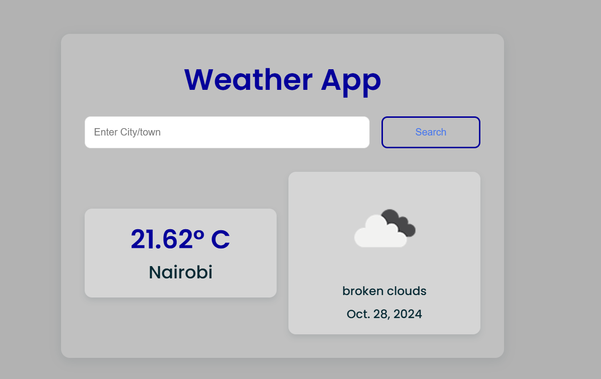

# Weather App 🌤️

A simple and intuitive weather app that fetches the current weather information of any city/town using the OpenWeatherMap API. Enter a city or town name and instantly get the temperature, weather description, and an icon representing the weather.



## Features

- Search for the current weather in any city worldwide.
- Displays temperature in Celsius, weather description, and an icon.
- Responsive and modern UI design.

## Tech Stack

- **Backend**: Django (Python)
- **Frontend**: HTML, CSS
- **API**: OpenWeatherMap API

## Installation

1. **Clone the repository**:
   ```bash
   git clone https://github.com/your-username/weather-app.git
   cd weather-app
   ```

2. **Create a virtual environment**:
   ```bash
   python -m venv venv
   source venv/bin/activate  # On Windows use `venv\Scripts\activate`
   ```

3. **Install dependencies**:
   ```bash
   pip install -r requirements.txt
   ```

4. **Add OpenWeatherMap API Key**:
   - Go to [OpenWeatherMap](https://openweathermap.org/) and sign up to get an API key.
   - Replace the `appid` in `views.py` with your API key.

5. **Run the migrations**:
   ```bash
   python manage.py migrate
   ```

6. **Run the app**:
   ```bash
   python manage.py runserver
   ```

7. **Access the app**:
   - Open a browser and go to `http://127.0.0.1:8000/`.

## Project Structure

- `weatherproject/`: Main Django project folder.
- `weatherapp/`: Django app that handles the weather fetching functionality.
  - `views.py`: Contains the logic to fetch data from OpenWeatherMap API.
  - `templates/weatherapp/index.html`: HTML template for displaying the weather information.
- `static/`: Contains CSS for styling.

## Usage

1. Enter the name of a city in the search box.
2. Click the "Search" button to fetch and display the current weather.

## Example

1. Enter "Kisumu" in the search box.
2. The app displays the temperature, weather description, and an icon representing the weather in Kisumu.

## License

This project is licensed under the MIT License.

---

Feel free to customize the `README.md` further based on your project specifics! Let me know if you need additional sections.
